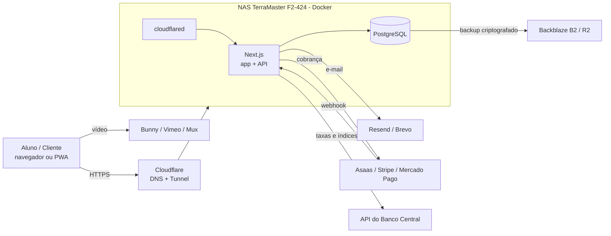
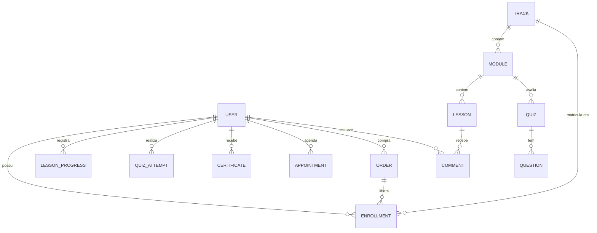
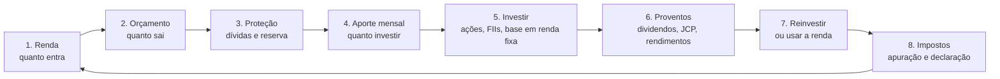

# Plano do App de Treinamentos e Consultoria em Investimentos (Brasil)

> **Versão:** 1.1 · **Data:** 07/10/2026
> **Objetivo:** criar uma plataforma web com login/senha para ministrar treinamentos de investimentos (do básico ao avançado) e atender clientes de consultoria, hospedada em um NAS TerraMaster F2-424.
> **Foco (v1.1):** ações, FIIs e gestão da renda (orçamento, aportes, carteira e renda passiva).

---

## Sumário

1. [Visão geral e premissas](#1-visão-geral-e-premissas)
2. [Pontos de atenção antes de começar](#2-pontos-de-atenção-antes-de-começar-leia-primeiro)
3. [Público, jornadas e funcionalidades](#3-público-jornadas-e-funcionalidades)
4. [Arquitetura e stack recomendada](#4-arquitetura-e-stack-recomendada)
5. [Hospedagem no NAS TerraMaster F2-424](#5-hospedagem-no-nas-terramaster-f2-424)
6. [Modelo de dados](#6-modelo-de-dados)
7. [Currículo: do básico ao avançado](#7-currículo-do-básico-ao-avançado)
8. [Experiência moderna e dinâmica (UX)](#8-experiência-moderna-e-dinâmica-ux)
9. [Segurança](#9-segurança)
10. [Aspectos legais e regulatórios](#10-aspectos-legais-e-regulatórios)
11. [Roadmap por fases](#11-roadmap-por-fases)
12. [Custos estimados](#12-custos-estimados)
13. [Riscos e mitigações](#13-riscos-e-mitigações)
14. [Métricas de sucesso (KPIs)](#14-métricas-de-sucesso-kpis)
15. [Checklist de lançamento](#15-checklist-de-lançamento)
16. [Decisões em aberto](#16-decisões-em-aberto)
17. [Anexos](#17-anexos)

---

## 1. Visão geral e premissas

**O que será construído:** uma plataforma web (responsiva, instalável como PWA) onde alunos e clientes fazem login, acompanham trilhas de aprendizado, usam simuladores financeiros, participam de aulas ao vivo e, no caso de consultoria, agendam sessões e acessam materiais individuais.

**Premissas deste plano**

| Item | Premissa |
|---|---|
| Quem desenvolve | Você, com apoio de IA (Claude) e, se necessário, freelancers pontuais |
| Quem ensina | Você (instrutor/administrador único no início) |
| Escala inicial | De dezenas a poucas centenas de alunos |
| Hospedagem | NAS TerraMaster F2-424 em casa/escritório |
| Idioma e público | Português (Brasil), foco em **renda variável (ações e FIIs)** e **gestão da renda** no mercado brasileiro |
| Formato do conteúdo | Vídeo gravado, texto, quizzes, simuladores e aulas ao vivo |

**Princípio guia:** lançar um **MVP enxuto em 6 a 8 semanas**, validar com alunos reais e só depois investir em funcionalidades avançadas.

---

## 2. Pontos de atenção antes de começar (leia primeiro)

Estes quatro pontos mudam decisões de projeto e devem ser tratados desde o início.

### 2.1 Regulação da CVM sobre "consultoria"

No Brasil, **recomendar valores mobiliários de forma personalizada** (ex.: "compre a ação X para a sua carteira") é atividade regulada pela CVM e exige registro como consultor de valores mobiliários. **Educação financeira genérica** (explicar como funciona um CDB, o que é um FII, como se calcula imposto) é diferente e não exige o mesmo registro.

Isso afeta o desenho do produto: você precisa decidir se vai operar como **educador** ou como **consultor registrado** (ou ambos, com separação clara). Detalhes na [seção 10](#10-aspectos-legais-e-regulatórios). **Converse com um advogado do mercado de capitais antes de vender o produto.**

### 2.2 Vídeo não deve sair do NAS

Servir vídeo direto de um NAS residencial é a decisão técnica que mais costuma dar problema: a velocidade de **upload** da maioria dos planos residenciais é baixa, e o NAS ficaria sobrecarregado quando vários alunos assistirem ao mesmo tempo. Além disso, os termos do Cloudflare Tunnel restringem a entrega de vídeo pesado por ele.

**Recomendação:** hospedar os vídeos em um serviço especializado (Bunny Stream, Vimeo, Mux, Cloudflare Stream ou YouTube não listado) e incorporá-los no app. O NAS cuida da aplicação, do banco de dados e dos arquivos leves (PDFs, planilhas).

### 2.3 Disponibilidade

Um NAS doméstico depende de energia e internet residenciais. Para um produto pago, planeje:

- **Nobreak** (mínimo para desligamento seguro e quedas curtas);
- **Internet com IP estável ou túnel** (muitos provedores brasileiros usam CGNAT, o que impede abrir portas);
- **Monitoramento externo** (UptimeRobot, Better Stack) com alerta no celular;
- **Plano de migração** para uma VPS caso o volume cresça (a arquitetura em Docker deste plano facilita isso).

### 2.4 RAID não é backup

Dois discos em RAID 1 protegem contra falha de **um disco**, não contra exclusão acidental, ransomware, incêndio ou erro de atualização. Veja a estratégia 3-2-1 na [seção 5.6](#56-backup-estratégia-3-2-1).

---

## 3. Público, jornadas e funcionalidades

### 3.1 Perfis de usuário

| Perfil | Descrição | Principais ações |
|---|---|---|
| **Visitante** | Chegou pela landing page | Conhecer o programa, ver aula grátis, comprar/cadastrar |
| **Aluno** | Matriculado em uma ou mais trilhas | Assistir aulas, fazer quizzes, usar simuladores, tirar dúvidas, emitir certificado |
| **Cliente de consultoria** | Atendimento individual ou em grupo | Agendar sessões, acessar plano e materiais privados, enviar documentos |
| **Administrador (você)** | Gestão total | Criar conteúdo, gerenciar alunos, ver métricas, publicar avisos, agendar lives |

### 3.2 Funcionalidades por prioridade

**Essenciais (MVP)**
- Cadastro, login, recuperação de senha, verificação de e-mail
- Catálogo de trilhas → módulos → aulas (vídeo + texto + anexos)
- Progresso do aluno (aulas concluídas, continuar de onde parou)
- Quiz ao final de cada módulo
- 4 simuladores básicos (juros compostos, orçamento e capacidade de aporte, renda passiva, reserva de emergência)
- Painel **Minha Renda** (versão simples): fontes de renda, orçamento mensal e meta de aporte
- Painel administrativo para criar/editar conteúdo sem mexer em código
- Controle de acesso por matrícula (quem pagou vê o que pagou)
- Termos de uso, política de privacidade e aviso de risco

**Importantes (fase 2)**
- Pagamento online (Pix, cartão, boleto) com liberação automática
- Certificado de conclusão em PDF com código de verificação
- Fórum/comentários por aula e perguntas e respostas
- Notificações por e-mail e push
- Aulas ao vivo agendadas com lembrete (calendário .ics)
- Painel do aluno com metas e sequência de estudos

**Diferenciais (fases 3 e 4)**
- Simuladores avançados (comparador de renda fixa líquido de IR, FIRE, rebalanceamento)
- Painel de mercado com Selic, CDI, IPCA e dólar atualizados via API
- Gamificação (pontos, selos, ranking opcional)
- Agenda e videochamada de consultoria integradas
- **Carteira de acompanhamento** do aluno (posições, preço médio, alocação e proventos recebidos)
- Calendário de proventos e índice de cobertura das despesas pela renda passiva
- Apoio ao IR de ações e FIIs (resumo anual e controle de vendas, como ferramenta de estudo)
- Carteira-modelo educacional (**apenas fins didáticos**, com aviso)
- Área de cliente com documentos e plano financeiro individual
- Recomendação de próxima aula com base no progresso

---

## 4. Arquitetura e stack recomendada

### 4.1 Construir ou usar plataforma pronta?

| Opção | Prós | Contras | Quando escolher |
|---|---|---|---|
| **A. Construir do zero** (recomendada para você) | Controle total, visual único, simuladores sob medida, sem mensalidade de plataforma | Exige tempo de desenvolvimento e manutenção | Você quer um produto próprio e dinâmico |
| **B. LMS open source** (Moodle, Open edX) hospedado no NAS | Pronto para cursos, quizzes, certificados | Visual datado, difícil personalizar, pesado para o hardware | Prioridade é lançar rápido, sem muita customização |
| **C. Plataforma SaaS** (Hotmart, Kajabi, LearnWorlds etc.) | Lançamento em dias, pagamento e vídeo inclusos | Mensalidade/comissão, pouca personalização, sem hospedar no NAS | Quer validar a demanda antes de investir em tecnologia |

**Sugestão de caminho:** como você quer algo moderno, dinâmico e hospedado no próprio NAS, siga com a **opção A**. Se tiver dúvida sobre demanda, valide antes com uma turma piloto usando a opção C (ou até Google Meet + planilha) enquanto desenvolve.

### 4.2 Stack sugerida

| Camada | Tecnologia | Motivo |
|---|---|---|
| Front-end + back-end | **Next.js (TypeScript)** | Um único projeto cobre site, app e API; ótimo suporte da comunidade e de IA para gerar código |
| Interface | **Tailwind CSS + shadcn/ui** | Visual moderno, componentes acessíveis, modo escuro |
| Gráficos | **Recharts** ou **Chart.js** | Simuladores e dashboards interativos |
| Banco de dados | **PostgreSQL 16** | Robusto, gratuito, roda bem em Docker |
| ORM | **Prisma** ou **Drizzle** | Migrações e tipagem segura |
| Autenticação | **Auth.js** ou **Better Auth** | Login por e-mail/senha, magic link, Google, 2FA |
| Senhas | **Argon2id** | Padrão atual de hash seguro |
| Conteúdo das aulas | **MDX** ou editor rich text (Tiptap) no admin | Texto formatado com componentes interativos embutidos |
| Vídeo | **Bunny Stream / Vimeo / Mux** (externo) | Ver [seção 2.2](#22-vídeo-não-deve-sair-do-nas) |
| Arquivos (PDF, planilhas) | Pasta no NAS ou **Cloudflare R2 / Backblaze B2** | Barato e fora do NAS (bom para backup também) |
| E-mail transacional | **Resend, Brevo ou Amazon SES** | Evita cair no spam; não envie e-mail direto do NAS |
| Pagamentos | **Asaas, Mercado Pago, Pagar.me ou Stripe** | Pix, cartão e boleto; confira taxas e suporte a assinaturas |
| Acesso externo | **Cloudflare Tunnel** + domínio `.com.br` | HTTPS sem abrir portas no roteador |
| Container | **Docker + Docker Compose (Portainer)** | O F2-424 suporta; facilita migrar para VPS |
| Monitoramento | **UptimeRobot / Better Stack** + logs (Sentry, plano gratuito) | Alerta antes que o aluno reclame |
| Analytics | **Plausible, Umami** (self-hosted) ou GA4 | Funil e engajamento |

### 4.3 Diagrama de arquitetura



### 4.4 Estrutura sugerida do repositório

```
app-investimentos/
├── src/
│   ├── app/                  # rotas (landing, login, painel, admin, aulas)
│   ├── components/           # UI reutilizável
│   ├── components/simuladores/
│   ├── lib/                  # auth, db, pagamentos, e-mail, utilitários
│   ├── server/               # regras de negócio e ações do servidor
│   └── content/              # aulas em MDX (opcional)
├── prisma/                   # schema e migrações
├── docker/
│   ├── Dockerfile
│   └── docker-compose.yml
├── scripts/                  # backup, seed, restauração
├── docs/                     # este plano, decisões, runbooks
└── .env.example
```

---

## 5. Hospedagem no NAS TerraMaster F2-424

### 5.1 O que o hardware oferece

Segundo as divulgações do fabricante e de sites especializados, o F2-424 tem:

- Processador **Intel Celeron N95** de 4 núcleos
- Memória **DDR5** (alguns anúncios citam 8 GB; **confira a quantidade instalada no seu equipamento**)
- **2 portas Ethernet de 2,5 GbE**
- **2 baias** de disco e **2 slots M.2 NVMe**
- Sistema **TOS** (5.x, com TOS 6 anunciado), com suporte a **Docker, Docker Compose e Portainer**
- RAID Single, 0, 1 e JBOD (e TRAID)

**Avaliação:** é suficiente para uma aplicação Next.js + PostgreSQL atendendo dezenas a algumas centenas de alunos, desde que o **vídeo fique fora do NAS** e o banco rode em SSD.

### 5.2 Configuração recomendada

| Item | Recomendação |
|---|---|
| **Discos (baias)** | 2 HDDs em **RAID 1** (espelhamento) para arquivos e backups locais |
| **SSD NVMe (M.2)** | 1 SSD para volumes do **Docker e do PostgreSQL** (muito mais rápido que HDD para banco de dados) |
| **Memória** | Se possível, ≥ 8 GB. Limite o uso de memória por container |
| **Rede** | Cabo na porta 2,5 GbE; IP fixo local; reserva de DHCP no roteador |
| **Energia** | **Nobreak** com autonomia mínima de 15-30 minutos e desligamento automático do NAS |
| **Atualizações** | Janela mensal para atualizar TOS, imagens Docker e dependências |

### 5.3 Acesso externo seguro

Muitos provedores brasileiros usam **CGNAT** (sem IP público) e abrir portas expõe o NAS. A opção mais simples e segura é o **Cloudflare Tunnel**:

1. Registre o domínio (ex.: `seudominio.com.br`) no Registro.br e aponte os nameservers para a Cloudflare (plano gratuito).
2. Crie um **Tunnel** no painel Zero Trust da Cloudflare e copie o token.
3. Rode o container `cloudflared` no NAS com esse token.
4. Configure o *Public Hostname* (`app.seudominio.com.br`) apontando para `http://app:3000`.
5. Ative **HTTPS obrigatório**, **WAF básico** e **rate limiting** na Cloudflare.
6. Proteja o painel do NAS e o Portainer: **não exponha** essas interfaces na internet; acesse-os por VPN (WireGuard/Tailscale) ou apenas na rede local.

### 5.4 Exemplo de `docker-compose.yml`

> Ajuste caminhos de volume ao padrão do TOS (ex.: `/Volume1/...`) e use variáveis de ambiente em um arquivo `.env` que **nunca** entra no Git.

```yaml
services:
  app:
    build: .
    restart: unless-stopped
    environment:
      DATABASE_URL: postgresql://app:${DB_PASSWORD}@db:5432/investimentos
      AUTH_SECRET: ${AUTH_SECRET}
      NEXT_PUBLIC_SITE_URL: https://app.seudominio.com.br
      EMAIL_API_KEY: ${EMAIL_API_KEY}
    depends_on:
      db:
        condition: service_healthy
    mem_limit: 1g

  db:
    image: postgres:16-alpine
    restart: unless-stopped
    environment:
      POSTGRES_USER: app
      POSTGRES_PASSWORD: ${DB_PASSWORD}
      POSTGRES_DB: investimentos
    volumes:
      - /caminho/no/ssd/postgres:/var/lib/postgresql/data
    healthcheck:
      test: ["CMD-SHELL", "pg_isready -U app -d investimentos"]
      interval: 10s
      timeout: 5s
      retries: 5
    mem_limit: 1g

  cloudflared:
    image: cloudflare/cloudflared:latest
    restart: unless-stopped
    command: tunnel --no-autoupdate run
    environment:
      TUNNEL_TOKEN: ${CLOUDFLARE_TUNNEL_TOKEN}
    depends_on:
      - app
```

### 5.5 Ambientes

Mantenha dois ambientes desde o início:

- **Desenvolvimento:** no seu computador (Docker local ou `npm run dev`).
- **Produção:** NAS. Faça deploy por `git pull` + `docker compose up -d --build`, ou use um registro de imagens (GitHub Container Registry) com **Watchtower** para atualizar. Teste mudanças locais antes de publicar.

Opcional: um segundo domínio (`staging.seudominio.com.br`) para testar atualizações com um grupo pequeno.

### 5.6 Backup: estratégia 3-2-1

**3 cópias, 2 tipos de mídia, 1 fora do local.**

| Cópia | Onde | Frequência |
|---|---|---|
| 1 (principal) | SSD do NAS (banco em produção) | Contínua |
| 2 | HDDs em RAID 1 do NAS (dump do banco + arquivos) | Diária |
| 3 | **Nuvem** (Backblaze B2 ou Cloudflare R2), criptografada | Diária |

- Use `pg_dump` agendado (cron) e envie com **restic** ou **rclone** para a nuvem, com criptografia.
- Mantenha retenção (ex.: 7 diários, 4 semanais, 6 mensais).
- **Teste a restauração** pelo menos a cada trimestre. Backup que nunca foi restaurado é uma suposição, não uma garantia.
- Guarde as senhas e chaves de criptografia fora do NAS (gerenciador de senhas).

---

## 6. Modelo de dados

### 6.1 Entidades principais



### 6.2 Tabelas (resumo)

| Tabela | Campos principais |
|---|---|
| `users` | id, nome, e-mail, senha_hash, papel (aluno/admin), 2fa_ativo, criado_em, ultimo_login |
| `tracks` | id, título, slug, descrição, nível (básico/intermediário/avançado), preço, publicado |
| `modules` | id, track_id, título, ordem |
| `lessons` | id, module_id, título, tipo (vídeo/texto/live), video_id, conteúdo_mdx, duração, ordem, gratuita |
| `quizzes` / `questions` | enunciado, alternativas, resposta correta, explicação, peso |
| `enrollments` | user_id, track_id, origem (compra/cortesia), início, expiração |
| `lesson_progress` | user_id, lesson_id, concluída, posição_do_vídeo, atualizado_em |
| `quiz_attempts` | user_id, quiz_id, nota, respostas, data |
| `orders` | id, user_id, valor, meio de pagamento, status, id_gateway, datas |
| `certificates` | user_id, track_id, código de verificação, emitido_em |
| `appointments` | user_id, início, fim, tipo, link da sala, status, notas |
| `comments` | lesson_id, user_id, texto, resposta_a, moderado |
| `income_sources` | user_id, descrição, tipo (salário, extra, aluguel...), valor, periodicidade |
| `budget_items` | user_id, mês, categoria, valor planejado, valor realizado |
| `goals` | user_id, tipo (reserva, aporte, renda passiva), valor-alvo, prazo, progresso |
| `portfolios` | user_id, nome, criado_em |
| `assets` | ticker, nome, tipo (ação, FII, ETF, Fiagro, BDR), setor/segmento |
| `transactions` | portfolio_id, asset_id, tipo (compra/venda), quantidade, preço, custos, data |
| `dividends` | portfolio_id, asset_id, tipo (dividendo, JCP, rendimento), valor, data com, data de pagamento |
| `audit_logs` | quem, ação, quando, IP (para ações sensíveis) |

**Regras de consentimento (LGPD):** registre aceite dos termos e da política de privacidade (versão + data + IP).

---

## 7. Currículo: do básico ao avançado

> **Foco do programa (v1.1):** **ações, FIIs e gestão da renda**. O aluno aprende a organizar o que ganha, definir quanto investir, escolher onde aplicar em renda variável e construir uma **renda passiva** consistente. A renda fixa entra como base de apoio (reserva e caixa), não como foco.
>
> **Atenção:** regras tributárias, limites e produtos mudam. **Valide cada número e regra na fonte oficial** (Receita Federal, CVM, Banco Central, B3, Tesouro Nacional, ANBIMA) antes de gravar as aulas e revise o conteúdo periodicamente. Mantenha a data da última revisão em cada aula.

### 7.1 Eixo central: o "ciclo da renda"

Todas as trilhas seguem o mesmo fio condutor, para que o aluno entenda onde cada decisão se encaixa:



### 7.2 Estrutura geral das trilhas

| # | Trilha | Nível | Duração sugerida | Resultado esperado |
|---|---|---|---|---|
| 1 | **Gestão da Renda** | Básico | 4 semanas | Orçamento funcionando, dívidas sob controle e um valor de aporte mensal definido |
| 2 | **Renda Fixa como Base** | Básico | 2 semanas | Reserva montada e noção de taxa livre de risco para comparar com renda variável |
| 3 | **Ações** | Intermediário | 6 semanas | Analisar empresas e investir em ações com critério |
| 4 | **FIIs e Fiagro** | Intermediário | 4 semanas | Escolher e acompanhar fundos imobiliários para renda mensal |
| 5 | **Renda Passiva e Dividendos** | Intermediário | 3 semanas | Estimar, construir e sustentar uma renda de proventos |
| 6 | **Carteira e Planejamento** | Intermediário | 4 semanas | Montar, aportar, rebalancear e acompanhar a carteira |
| 7 | **Impostos e Declaração** | Intermediário | 3 semanas | Apurar imposto de ações e FIIs e declarar corretamente |
| 8 | **Avançado** | Avançado | 6-8 semanas | Exterior, opções, previdência, macro e sucessão |

**Caminhos sugeridos**

- **Iniciante:** 1 → 2 → 3 e 4 (em paralelo) → 5 → 6 → 7 → 8
- **Quem já investe:** 3 → 4 → 5 → 6 → 7 → 8 (com diagnóstico inicial para pular o que já domina)
- **Foco em renda mensal:** 1 → 4 → 5 → 6 → 7

---

### Trilha 1 · Gestão da Renda (Básico)

**Módulo 1.1 · Diagnóstico financeiro**
- Fontes de renda: salário, pró-labore, comissões, renda extra, aluguéis e proventos
- Renda bruta × renda líquida; descontos, benefícios e encargos
- Balanço pessoal: ativos, dívidas e patrimônio líquido
- **Taxa de poupança** (quanto da renda sobra) como principal indicador do início da jornada

**Módulo 1.2 · Orçamento que funciona**
- Categorias: custos fixos, variáveis, lazer, objetivos e investimentos
- Métodos: 50/30/20, "pague-se primeiro", orçamento base zero e envelopes
- Como registrar gastos sem complicar (planilha, app ou o **Painel Minha Renda**)
- Corte inteligente de despesas × aumento de renda

**Módulo 1.3 · Dívidas e proteção**
- Dívidas caras (cartão rotativo, cheque especial, empréstimos): priorização e renegociação
- **Reserva de emergência:** quanto, onde e quando está "completa"
- Seguros essenciais e proteção da renda da família

**Módulo 1.4 · Renda variável do trabalhador (autônomos, PJ, comissionados)**
- Como orçar com renda irregular: renda-base, média dos últimos 12 meses e "salário" pago a si mesmo
- Reserva maior para quem tem renda instável
- Separar finanças pessoais das da empresa; pró-labore × distribuição de lucros (conceitos e pontos de atenção)

**Módulo 1.5 · Do orçamento ao aporte**
- Definindo o **valor do aporte mensal** e automatizando
- Objetivos por prazo: curto, médio e longo
- Perfil de investidor e tolerância a oscilações
- Fraudes e promessas de retorno garantido

**Fluxo de decisão do aporte (exemplo didático)**

| Etapa | Pergunta | Se "não" |
|---|---|---|
| 1 | Tenho dívidas caras? | Priorize quitá-las antes de investir em renda variável |
| 2 | Minha reserva de emergência está completa? | Direcione o aporte à reserva até completar |
| 3 | Tenho objetivos de curto prazo (até ~2 anos)? | Destine esse dinheiro a ativos de baixa oscilação |
| 4 | Sobrou valor para o longo prazo? | Esse valor pode ser aplicado em renda variável, conforme perfil |

> Exemplo educacional. Não é recomendação individual de alocação.

---

### Trilha 2 · Renda Fixa como Base

**Módulo 2.1 · O papel da renda fixa para quem investe em renda variável**
- Reserva, caixa para oportunidades e objetivos de curto prazo
- **Selic/CDI como taxa livre de risco:** por que ela é o "piso" de comparação de ações e FIIs
- Juros reais × nominais e o efeito da inflação (IPCA)

**Módulo 2.2 · Produtos essenciais**
- Tesouro Selic, prefixado e IPCA+; marcação a mercado
- CDB, LCI, LCA e a cobertura do **FGC**
- Liquidez e risco de crédito: o que checar antes de aplicar

**Módulo 2.3 · Rentabilidade líquida**
- Tabela regressiva de IR e IOF em resgates antecipados
- Como comparar investimentos com e sem IR
- Simulador: CDB × LCI/LCA × Tesouro × Poupança

---

### Trilha 3 · Ações

**Módulo 3.1 · Como funciona a bolsa**
- B3, corretoras, pregão, leilões, horários e tipos de ordem
- ON, PN e Units; tickers, lote padrão e fracionário
- Índices: Ibovespa, IDIV, SMLL e outros
- Custos: corretagem, emolumentos e custódia

**Módulo 3.2 · Proventos das ações**
- Dividendos, JCP, bonificações, desdobramentos e grupamentos
- Data com, data ex e efeito no preço
- Como o provento chega à conta e como entra no seu controle

**Módulo 3.3 · Análise fundamentalista**
- Ler balanço, DRE e fluxo de caixa
- Indicadores: P/L, P/VP, ROE, ROIC, margens, dívida líquida/EBITDA, payout e dividend yield
- Valuation básico: múltiplos e fluxo de caixa descontado
- Análise setorial (bancos, energia, saneamento, varejo, commodities) e governança
- Leitura de **ITR/DFP** e do release de resultados

**Módulo 3.4 · Estratégias e comportamento**
- Valor, dividendos, crescimento e qualidade
- Preço justo e **margem de segurança**; limites de métodos populares de preço-teto
- Vieses comportamentais e como evitar decisões por impulso
- Investir × especular × operar

**Módulo 3.5 · Análise técnica (introdução)**
- Tendência, suporte/resistência, volume e médias móveis
- Limitações e vieses; diferença entre investir e operar

---

### Trilha 4 · FIIs e Fiagro

**Módulo 4.1 · Como funcionam os fundos imobiliários**
- Estrutura: cotas, administrador, gestor, cotistas e regulamento
- Distribuição periódica de rendimentos (conceito e obrigações regulatórias)
- Tipos: tijolo (lajes, logística, shoppings, hospitais), papel (CRI), híbridos, fundos de fundos e desenvolvimento
- **Fiagro** e a ligação com o agronegócio

**Módulo 4.2 · Como analisar um FII**
- Indicadores: dividend yield, P/VP, vacância (física e financeira), WAULT, inadimplência, alavancagem
- Qualidade dos imóveis, locatários, localização e contratos (típicos e atípicos)
- FIIs de papel: indexadores (CDI, IPCA), risco de crédito, LTV, garantias e concentração
- **Resultado recorrente × não recorrente:** como saber se o rendimento é sustentável
- Leitura do **relatório gerencial** e da lâmina

**Módulo 4.3 · Construindo uma carteira de FIIs**
- Diversificação por segmento, gestor e ativos
- Liquidez, volume negociado e spread
- Eventos: emissões de cotas, diluição e direito de preferência
- Riscos: vacância, calote, juros altos, concentração e má gestão

**Módulo 4.4 · Tributação (visão geral)**
- Rendimentos mensais: condições para isenção a pessoa física (**validar regras vigentes**)
- Ganho de capital na venda das cotas e apuração
- Informe de rendimentos e declaração

---

### Trilha 5 · Renda Passiva e Dividendos

**Módulo 5.1 · Conceitos de renda passiva**
- Renda **ativa × passiva** e o que realmente é "passivo"
- Yield on cost × dividend yield atual
- Proventos reais (descontada a inflação) e crescimento da renda ao longo do tempo

**Módulo 5.2 · Quanto preciso investir?**
- Fórmula didática: `patrimônio necessário = renda mensal desejada × 12 ÷ yield líquido anual`
- "Número mágico" de cotas: `cotas = renda mensal desejada ÷ provento por cota` (exemplo hipotético: R$ 1.000/mês com provento de R$ 1,00/cota exige 1.000 cotas)
- **Índice de cobertura:** renda passiva ÷ despesas mensais (meta pessoal de independência)
- Simulador de renda passiva

**Módulo 5.3 · Sustentabilidade dos proventos**
- Ações: payout, geração de caixa, endividamento, ciclo do setor e proventos extraordinários
- FIIs: recorrência do resultado, reserva, vacância e inadimplência
- **Armadilhas de yield alto** (dividend trap) e sinais de alerta

**Módulo 5.4 · Reinvestir ou consumir**
- O efeito "bola de neve" dos juros compostos aplicados aos proventos
- Regras de reinvestimento: quando reinvestir, quando usar e como rebalancear
- Fase de acumulação × fase de usufruto
- Calendário de proventos e planejamento de fluxo de caixa

---

### Trilha 6 · Carteira e Planejamento

**Módulo 6.1 · Montando a carteira**
- Alocação por objetivo e prazo (caixa, renda fixa, ações, FIIs, exterior)
- Diversificação, concentração e correlação
- Tamanho de posição e limites por ativo

**Módulo 6.2 · Aportes e rebalanceamento**
- Aportes periódicos e **preço médio**
- Rebalancear **com aportes** (mais barato e simples) e por bandas
- Quando vender e por quê (e quando não vender)

**Módulo 6.3 · Acompanhamento**
- Retorno total (preço + proventos), volatilidade e drawdown
- Benchmarks: CDI, IPCA+, Ibovespa, IFIX
- Rotina de revisão (mensal, trimestral e anual)
- **Política de investimentos pessoal (IPS):** regras escritas antes de entrar em crise

**Módulo 6.4 · Planejamento de longo prazo**
- Independência financeira (FIRE) e a regra dos 4% (limitações no Brasil)
- Aposentadoria: INSS × previdência × carteira própria
- Simulador de independência financeira

---

### Trilha 7 · Impostos e Declaração

**Módulo 7.1 · Ações**
- Isenção para vendas até determinado valor no mês (**validar limite vigente**), alíquotas de operações comuns e day trade
- Compensação de prejuízos e controle de preço médio
- Apuração mensal, DARF e prazos
- Dividendos e JCP: regras de tributação e **mudanças recentes** (validar legislação vigente)

**Módulo 7.2 · FIIs e ETFs**
- Ganho de capital, apuração e DARF
- Rendimentos de FIIs: condições de isenção e declaração
- ETFs: regras de tributação

**Módulo 7.3 · Declaração de Imposto de Renda**
- Bens e direitos, rendimentos isentos e tributados exclusivamente na fonte, renda variável
- Informe de rendimentos das corretoras e conferência com a **Área do Investidor da B3**
- Erros comuns e malha fina
- Planilha/ferramenta de apuração

---

### Trilha 8 · Avançado

**Módulo 8.1 · Investimentos no exterior**
- BDRs, ETFs de bolsas estrangeiras e contas globais
- Câmbio, risco cambial e custos
- Tributação e declaração (inclui obrigações junto ao Banco Central quando aplicável)

**Módulo 8.2 · Opções e geração de renda (introdução responsável)**
- Calls e puts, prêmio, vencimento e exercício
- **Venda coberta** como estratégia de renda: potencial e riscos
- Proteção de carteira (put protetora, collar)
- Gestão de risco, alavancagem e armadilhas; COE e produtos estruturados

**Módulo 8.3 · Aluguel de ativos e outras fontes de renda**
- Empréstimo de ações (BTC): como funciona, ganhos e tributação
- Fundos de ações e multimercado: taxas e come-cotas
- Previdência privada (PGBL × VGBL) e quando considerar

**Módulo 8.4 · Macroeconomia aplicada**
- Ciclo de juros, curva, inflação e câmbio
- Relatório Focus, ata do Copom e leitura de indicadores
- Impacto do macro em ações, FIIs de tijolo e FIIs de papel

**Módulo 8.5 · Patrimônio e sucessão**
- Planejamento sucessório e holding (conceitos e cuidados)
- Seguros e proteção patrimonial
- Educação financeira da família

**Módulo 8.6 · Projeto final**
- Montar sua **política de investimentos** completa e um plano de renda passiva
- Apresentação e feedback em aula ao vivo

---

### 7.3 Ferramenta central do app: "Minha Renda"

Para o aluno **praticar a gestão da renda dentro da plataforma**, o app terá um painel pessoal integrado às aulas.

| Bloco | O que o aluno faz | Aula relacionada |
|---|---|---|
| **Fontes de renda** | Cadastra salário, renda extra, aluguéis etc. (valores e periodicidade) | 1.1 |
| **Orçamento mensal** | Define categorias, metas e acompanha gasto × planejado | 1.2 |
| **Meta de aporte** | Define quanto investir por mês e registra os aportes | 1.5 e 6.2 |
| **Reserva de emergência** | Acompanha o progresso até a meta | 1.3 |
| **Carteira de acompanhamento** | Registra suas posições e compras (manual ou por importação de planilha/extrato) e vê preço médio, alocação e proventos recebidos | 6.1 a 6.3 |
| **Renda passiva** | Vê proventos recebidos por mês, evolução e **índice de cobertura** das despesas | 5.1 a 5.4 |
| **Calendário de proventos** | Agenda de pagamentos de ativos da própria carteira | 5.4 |
| **Apoio ao IR** | Resumo anual de proventos e controle de vendas (como **apoio de estudo**, não substitui contador) | 7.1 a 7.3 |
| **Metas e conquistas** | Selos por hábitos (3 meses de aporte seguido, reserva completa etc.) | Todas |

Indicadores exibidos no painel: taxa de poupança, aporte médio, patrimônio investido, alocação por classe, proventos acumulados em 12 meses, renda passiva mensal média e cobertura das despesas.

**Cuidados de produto**
- O painel registra e organiza **os dados do próprio aluno**; não deve indicar "compre/venda" nem sugerir ativos específicos (veja [seção 10.5](#105-carteira-de-acompanhamento-e-dados-de-mercado)).
- Dados sensíveis (patrimônio, posições) exigem criptografia, controle de acesso e opção de **exportar e excluir** tudo (LGPD).
- O aluno deve poder usar **entrada manual** sem conectar contas bancárias ou corretoras (reduz risco e complexidade).

### 7.4 Formato padrão de cada aula

| Elemento | Duração/Detalhe |
|---|---|
| Vídeo | 6-12 minutos, objetivo e visual |
| Resumo escrito | Pontos-chave + glossário |
| Material de apoio | PDF, planilha ou link oficial |
| Exercício prático | Simulador, estudo de caso ou tarefa no **Minha Renda** |
| Mini-quiz | 3-5 questões, com explicação |
| Aviso de revisão | "Conteúdo revisado em MM/AAAA" |

**Regra de ouro para todo conteúdo:** ensinar **como funciona e como avaliar**, não prometer retorno nem indicar ativos específicos como recomendação personalizada. Em estudos de caso com empresas e fundos reais, use **dados históricos, finalidade didática e aviso de risco** (veja [seção 10](#10-aspectos-legais-e-regulatórios)).

---

## 8. Experiência moderna e dinâmica (UX)

### 8.1 Princípios de design

- **Visual limpo e confiável:** muito espaço em branco, tipografia legível, cores sóbrias com um acento forte
- **Modo claro/escuro** e responsividade total (a maioria dos alunos assistirá pelo celular)
- **PWA:** instalável na tela inicial, com abertura rápida
- **Microinterações:** animações suaves, barras de progresso, confete ao concluir um módulo
- **Acessibilidade:** contraste, navegação por teclado, legendas nos vídeos, texto alternativo

### 8.2 Simuladores interativos (diferencial do produto)

| Simulador | O que faz |
|---|---|
| Juros compostos | Aporte inicial/mensal, taxa, prazo → gráfico de evolução e comparação com juros simples |
| Reserva de emergência | Despesas fixas → meta de reserva em meses e plano para atingi-la |
| Comparador de renda fixa | CDB × LCI/LCA × Tesouro × Poupança, **líquido de IR/IOF**, por prazo |
| Independência financeira | Renda desejada, aportes e rentabilidade real → quando atinge a meta |
| Rebalanceador | Informa alocação atual e alvo → mostra quanto comprar/vender |
| Dividend yield | Renda passiva estimada de uma carteira hipotética |
| Impacto da inflação | Poder de compra ao longo do tempo |
| Orçamento e capacidade de aporte | Renda e despesas → taxa de poupança e quanto investir por mês |
| Renda passiva (número mágico) | Renda mensal desejada → patrimônio e cotas necessárias, com yield hipotético |
| Bola de neve de proventos | Reinvestimento de dividendos/rendimentos ao longo do tempo (com e sem inflação) |
| Preço médio e resultado | Compras e vendas → preço médio, lucro/prejuízo e imposto estimado (didático) |
| Cobertura de despesas | Renda passiva ÷ despesas fixas, com meta e prazo estimado |

> Todos os simuladores devem exibir: *"Simulação educacional. Rentabilidade passada ou projetada não garante resultados futuros."*

### 8.3 Dados de mercado em tempo real

- **API de séries temporais do Banco Central (SGS):** Selic, CDI, IPCA e outros indicadores (confira os códigos de série na documentação oficial)
- **Dados abertos do Tesouro Nacional:** taxas e preços dos títulos públicos
- **Cotações:** serviços de terceiros com planos gratuitos/pagos (verifique limites, atraso das cotações e termos de uso antes de escolher)
- Faça **cache** no servidor (ex.: atualizar a cada 15-60 minutos) para não depender da API a cada acesso

### 8.4 Engajamento e retenção

- **Sequência de estudos** (streaks) e metas semanais
- **Selos e conquistas** (primeira reserva montada, trilha concluída)
- **Perguntas e respostas** por aula, com respostas suas ou de monitores
- **Lives mensais** (Q&A) com replay automático
- **E-mails automáticos:** boas-vindas, lembrete de retomada, nova aula, aniversário de matrícula
- **Comunidade** (Discord/Telegram/WhatsApp) opcional, com regras claras e moderação

### 8.5 Painel do administrador

- Criar/editar trilhas, módulos e aulas (arrastar e soltar para reordenar)
- Editor visual para texto e inserção de simuladores
- Gestão de alunos: matrículas, cortesias, reembolsos, notas
- Relatórios: conclusão por aula, quizzes mais errados, aulas abandonadas
- Central de comunicados e agendamento de lives

---

## 9. Segurança

| Tema | Boas práticas |
|---|---|
| **Senhas** | Hash com **Argon2id**, política mínima de força, checagem contra senhas vazadas |
| **Login** | Rate limiting, bloqueio progressivo, alerta de novo dispositivo, **2FA (TOTP)** para administrador (obrigatório) e opcional para alunos |
| **Sessões** | Cookies `HttpOnly`, `Secure`, `SameSite`; expiração e revogação de sessões |
| **Autorização** | Controle por papel (RBAC); validar a matrícula **no servidor** a cada acesso ao conteúdo |
| **Proteção do conteúdo** | Vídeos com URL assinada e expiração, marca d'água dinâmica com o nome/e-mail do aluno, limite de sessões simultâneas |
| **Aplicação** | Proteção contra XSS, CSRF e injeção de SQL (ORM com queries parametrizadas); sanitizar comentários; cabeçalhos de segurança (CSP, HSTS) |
| **Infraestrutura** | NAS e Portainer fora da internet pública; VPN para administração; atualizações regulares; usuário sem privilégios nos containers |
| **Segredos** | Variáveis de ambiente, nunca no Git; rotação de chaves |
| **Pagamentos** | Nunca armazene dados de cartão; use o checkout do gateway e valide **webhooks** por assinatura |
| **Dados pessoais** | Colete o mínimo necessário, criptografe backups, defina retenção e processo para solicitações de titulares (LGPD) |
| **Monitoramento** | Logs de auditoria, alertas de erro (Sentry), uptime externo |
| **Resposta a incidentes** | Documente um plano simples: quem faz o quê, como avisar alunos e a ANPD, se houver vazamento |

---

## 10. Aspectos legais e regulatórios

> Esta seção é um **guia de pontos a validar**, não aconselhamento jurídico. Consulte um advogado especializado em mercado de capitais e proteção de dados.

### 10.1 CVM: educação × consultoria × recomendação

- A atividade de **consultoria de valores mobiliários** é regulada pela CVM (**Resolução CVM 19/2021**) e exige autorização/registro, com requisitos como certificação e conduta.
- A **análise de valores mobiliários** (relatórios públicos de análise) é regulada pela **Resolução CVM 20/2021**.
- **Educação financeira** e ensino sobre como os produtos funcionam são atividades distintas da recomendação personalizada.
- Regras de **adequação do investidor (suitability)** existem para quem recomenda produtos (ex.: **Resolução CVM 30/2021**).

**Pontos práticos para o produto**
1. Defina claramente o que você oferece: **curso educacional**, **consultoria registrada**, ou os dois (com contratos e comunicação separados).
2. Se for educacional: evite indicar ativos específicos como "compre/venda" personalizados; use exemplos genéricos e **carteiras-modelo didáticas** com avisos claros.
3. Se for consultoria: avalie o registro como **consultor de valores mobiliários** (pessoa física ou jurídica) e as exigências de contrato, suitability, relatórios e arquivo de registros.
4. Evite promessas de rentabilidade e depoimentos que sugiram ganhos garantidos.
5. Avisos obrigatórios nas páginas, aulas, simuladores e e-mails (modelo na [seção 17.2](#172-modelo-de-aviso-de-risco-adaptar-com-seu-advogado)).
6. Confira se o seu relacionamento com corretoras/gestoras (links de indicação, comissões) exige **divulgação de conflito de interesses**.

### 10.2 Proteção de dados (LGPD)

- Base legal clara para cada tratamento (execução de contrato, consentimento etc.)
- **Política de privacidade** e **termos de uso** acessíveis, com registro de aceite
- Canal para direitos do titular (acesso, correção, exclusão) e um **encarregado (DPO)** indicado
- Contratos/termos com operadores (e-mail, pagamento, vídeo, hospedagem de backup)
- Atenção ao transferir dados para fora do Brasil (serviços internacionais)

### 10.3 Consumidor e comércio eletrônico

- **CDC:** direito de arrependimento em até 7 dias para compras online (art. 49)
- Informações claras de preço, prazo de acesso, política de reembolso e suporte
- Nota fiscal de serviço (NFS-e): defina o **regime tributário** (MEI/Simples/outro) com seu contador; verifique se sua atividade e faturamento são compatíveis

### 10.4 Propriedade intelectual

- Conteúdo próprio: proteja com termos de uso e cláusula de proibição de redistribuição
- Imagens, músicas e dados de terceiros: use apenas o que tiver licença
- Marcas de corretoras/produtos: use de forma informativa e sem sugerir parceria inexistente

### 10.5 Carteira de acompanhamento e dados de mercado

- **Registro dos dados do próprio aluno** (posições, aportes, proventos) é ferramenta de organização; **indicar o que comprar ou vender** a cada aluno é recomendação personalizada (veja 10.1). Mantenha o painel neutro.
- **Cotações e dados de mercado:** a redistribuição de dados da B3 e de terceiros pode ter **regras de licenciamento e atraso**. Confira os termos antes de exibir cotações e comece com **entrada manual**, dados de fechamento ou fonte com licença clara.
- **Dados patrimoniais** do aluno são sensíveis: mínimo necessário, criptografia, exportação e exclusão (LGPD).
- **Apoio ao IR** é material educacional: deixe claro que não substitui contador nem a conferência oficial na Receita e na Área do Investidor da B3.
- **Estudos de caso com empresas/fundos reais:** use dados históricos, finalidade didática e avisos; evite sugerir que o ativo seja uma indicação.

---

## 11. Roadmap por fases

> Estimativas para **uma pessoa em tempo parcial**, usando IA para acelerar a codificação. Ajuste conforme sua disponibilidade.

### Fase 0 · Descoberta e validação (semanas 1-2)

| Entrega | Detalhe |
|---|---|
| Definição do produto | Público-alvo, promessa, trilha inicial, preço, formato (gravado/ao vivo) |
| Validação | Conversar com 10-20 pessoas do público; lista de espera na landing page |
| Jurídico | Reunião com advogado sobre CVM/LGPD e definição do enquadramento |
| Conteúdo | Roteiro da Trilha 1 e gravação de 2-3 aulas-piloto |
| Marca | Nome, logo simples, paleta e domínio `.com.br` |

**Critério de saída:** pelo menos 20-30 interessados reais e enquadramento regulatório definido.

### Fase 1 · Infraestrutura (semana 2-3)

| Entrega | Detalhe |
|---|---|
| NAS preparado | Atualização do TOS, Docker/Portainer, RAID 1, SSD M.2 para banco |
| Rede e acesso | Cloudflare Tunnel, domínio, HTTPS, firewall |
| Projeto base | Repositório Git, Next.js + Tailwind + shadcn/ui, Prisma/Postgres via Docker Compose |
| Backup | `pg_dump` + envio criptografado para a nuvem e **primeiro teste de restauração** |
| Monitoramento | Uptime externo + alerta no celular |

**Critério de saída:** "Hello World" acessível em `https://app.seudominio.com.br` com backup funcionando.

### Fase 2 · MVP (semanas 3-8)

| Semana | Entregas |
|---|---|
| 3-4 | Autenticação (cadastro, login, recuperação, verificação de e-mail), perfis, layout base e landing page |
| 5 | Modelo de dados, painel admin (CRUD de trilhas/módulos/aulas), upload e incorporação de vídeo |
| 6 | Área do aluno: catálogo, player, progresso, anexos |
| 7 | Quizzes + simuladores (juros compostos, orçamento/aporte, renda passiva, reserva) e **Minha Renda v1** (renda, orçamento e meta de aporte) |
| 8 | Matrículas manuais/cortesias, termos/privacidade/aviso de risco, testes e correções |

**Critério de saída:** 10-20 alunos-piloto concluindo a Trilha 1 sem ajuda técnica; feedback coletado.

### Fase 3 · Monetização e engajamento (semanas 9-12)

- Integração de **pagamento** (Pix, cartão, boleto) com webhooks e liberação automática
- E-mails transacionais e de relacionamento
- Certificado com código de verificação
- Comentários e perguntas por aula
- Painel de métricas para o administrador
- Cupons e planos (aluno avulso × assinatura)

**Critério de saída:** primeira venda automática de ponta a ponta.

### Fase 4 · Consultoria e ao vivo (semanas 13-18)

- Agenda de sessões (disponibilidade, fuso, lembretes, reagendamento)
- Videochamada (link Google Meet/Zoom/Jitsi ou integração)
- Área do cliente: documentos, plano e histórico de sessões
- Aulas ao vivo com replay
- Registro e arquivo de atendimentos (necessário se atuar como consultor registrado)

### Fase 5 · Dados de mercado e gamificação (semanas 19-24)

- Painel com indicadores do BCB/Tesouro com cache
- **Carteira de acompanhamento** (importação de planilha/extrato), proventos e calendário
- Índice de cobertura e apoio ao IR de ações e FIIs
- Simuladores avançados (FIRE, rebalanceador, bola de neve de proventos)
- Gamificação, metas e recomendações de próxima aula
- Trilhas 3 a 6 (Ações, FIIs, Renda Passiva, Carteira) publicadas

### Fase 6 · Escala e evolução (a partir do mês 7)

- Trilhas 7 e 8 (Impostos e Avançado), comunidade, programa de indicação
- Otimização de desempenho e testes de carga
- Avaliar **migração para VPS/cloud** se: mais de ~300-500 alunos ativos simultâneos esperados, picos em lives, ou necessidade de SLA maior
- App móvel nativo (opcional) se o PWA não for suficiente

---

## 12. Custos estimados

> Valores **aproximados e sujeitos a mudança**. Confirme preços atuais em cada fornecedor.

### 12.1 Custos iniciais

| Item | Estimativa |
|---|---|
| Domínio `.com.br` (Registro.br) | ~R$ 40/ano |
| Nobreak adequado | R$ 400-1.500 (se ainda não tiver) |
| SSD NVMe para banco/Docker | R$ 250-600 |
| Equipamento de gravação (microfone, iluminação, webcam) | R$ 500-2.500 |
| Consulta jurídica inicial (CVM/LGPD/termos) | Variável, orçar com advogado |
| Identidade visual (opcional) | Variável |

### 12.2 Custos mensais recorrentes

| Item | Estimativa / Observação |
|---|---|
| Cloudflare (DNS + Tunnel) | Plano gratuito atende o início |
| Hospedagem de vídeo (Bunny/Vimeo/Mux) | Depende de horas e visualizações; comece pelo plano mais baixo |
| E-mail transacional | Planos gratuitos costumam cobrir o início |
| Backup em nuvem (B2/R2) | Poucos reais por mês para centenas de GB |
| Gateway de pagamento | Taxa por transação (percentual + valor fixo) |
| Monitoramento | Gratuito no início |
| Contador | Mensalidade variável |
| Energia do NAS | Baixo consumo (equipamento enxuto) |

---

## 13. Riscos e mitigações

| Risco | Probabilidade | Impacto | Mitigação |
|---|---|---|---|
| Atuar como consultor sem registro | Média | **Alto** | Definir enquadramento com advogado; separar educação de consultoria |
| Queda de energia/internet | Alta | Médio | Nobreak, monitoramento, comunicar janelas de manutenção, plano de contingência em VPS |
| Falha de disco / perda de dados | Média | **Alto** | RAID 1 + backup 3-2-1 + teste de restauração |
| Vazamento de dados de alunos | Baixa | **Alto** | Segurança em camadas, mínimo de dados, plano de incidente |
| Vídeos sobrecarregando o NAS | Alta (se hospedado local) | Alto | Hospedar vídeo em serviço externo |
| Conteúdo desatualizado (regras fiscais mudam) | Alta | Médio | Data de revisão por aula, rotina trimestral de revisão |
| Pirataria/compartilhamento de acesso | Média | Médio | URLs assinadas, marca d'água, limite de sessões |
| Baixa adesão | Média | Alto | Validar na Fase 0, turma-piloto, aula gratuita como isca |
| Burnout/falta de tempo (você faz tudo) | Média | Alto | Escopo enxuto, automatizar, contratar suporte pontual |
| Dependência de serviços de terceiros | Média | Médio | Evitar lock-in; manter exportação de dados e docker-compose portátil |

---

## 14. Métricas de sucesso (KPIs)

| Área | Métrica | Meta inicial sugerida |
|---|---|---|
| **Aquisição** | Visitantes → cadastros | 5-10% |
| **Ativação** | Cadastros que assistem à 1ª aula em 48h | > 60% |
| **Engajamento** | Taxa de conclusão da Trilha 1 | > 40% |
| **Aprendizado** | Nota média dos quizzes / refação | ≥ 70% |
| **Retenção** | Alunos ativos no mês 2 | > 50% |
| **Receita** | Conversão visitante → pagante | 1-3% |
| **Satisfação** | NPS ou nota média das aulas | > 8/10 |
| **Suporte** | Tempo médio de resposta | < 24h |
| **Técnica** | Disponibilidade mensal | ≥ 99% |

---

## 15. Checklist de lançamento

**Produto**
- [ ] Trilha 1 completa (vídeos, textos, quizzes, simuladores)
- [ ] Aulas revisadas (conteúdo conferido nas fontes oficiais, data de revisão)
- [ ] Fluxo completo testado: cadastro → compra → acesso → certificado
- [ ] Teste em celular, tablet e navegadores diferentes

**Técnico**
- [ ] HTTPS ativo, WAF/rate limit configurados
- [ ] 2FA obrigatório para administrador
- [ ] Backups automáticos funcionando **e restauração testada**
- [ ] Monitoramento e alertas configurados
- [ ] Nobreak instalado e testado
- [ ] Variáveis secretas fora do Git; senhas padrão alteradas
- [ ] Plano de contingência/migração documentado

**Legal**
- [ ] Enquadramento CVM definido e validado com advogado
- [ ] Termos de uso, política de privacidade e aviso de risco publicados
- [ ] Registro de consentimentos e canal do titular (LGPD)
- [ ] Política de reembolso (inclui o direito de arrependimento)
- [ ] Emissão de nota fiscal configurada com o contador

**Negócio**
- [ ] Preço e planos definidos
- [ ] Página de vendas e página de obrigado
- [ ] E-mails automáticos de boas-vindas e acompanhamento
- [ ] Canal de suporte definido (e-mail/WhatsApp) com horário
- [ ] Turma-piloto com depoimentos (sem promessas de ganho)

---

## 16. Decisões em aberto

Responda estas perguntas para refinarmos o plano:

1. **Enquadramento:** será um curso **educacional**, uma **consultoria registrada na CVM**, ou ambos?
2. **Modelo de venda:** curso avulso, assinatura mensal, mentoria em grupo ou consultoria individual?
3. **Formato principal:** vídeo gravado, aulas ao vivo ou híbrido?
4. **Tamanho esperado** do público nos primeiros 6 meses?
5. **Perfil do aluno:** iniciante absoluto, quem já investe, ou ambos?
6. **Orçamento mensal** disponível para ferramentas e vídeo?
7. **Prazo desejado** para lançar o MVP?
8. **Conhecimento técnico:** você mesmo vai programar ou pretende contratar alguém?
9. **Identidade:** nome do projeto e domínio já definidos?
10. **Conteúdo existente:** já tem material (apostilas, vídeos, planilhas) para reaproveitar?
11. **Gestão da renda:** o aluno vai apenas **aprender** (aulas e simuladores) ou também **registrar a própria carteira e orçamento** no app?
12. **Dados de mercado:** entrada manual no início ou cotações automáticas (com custo e licenciamento)?
13. **Estudos de caso:** pretende analisar ativos reais em aula? (impacta o enquadramento regulatório)

---

## 17. Anexos

### 17.1 Prompt-base para gerar o projeto com IA

Use este texto em uma ferramenta de desenvolvimento assistido por IA (como o Claude Code) para iniciar o projeto:

```text
Crie um app web em Next.js (App Router, TypeScript), Tailwind CSS e shadcn/ui
para uma plataforma de treinamentos de investimentos no Brasil.

Requisitos:
- Autenticação por e-mail e senha (Argon2id), verificação de e-mail e recuperação de senha
- Papéis: aluno e admin; 2FA TOTP obrigatório para admin
- Banco PostgreSQL com Prisma; schema com users, tracks, modules, lessons,
  quizzes, questions, enrollments, lesson_progress, orders, certificates
- Painel admin para CRUD de trilhas, módulos e aulas, com reordenação
- Área do aluno: catálogo, player de vídeo incorporado (URL assinada),
  progresso, anexos, quiz por módulo
- Simuladores em React com Recharts: juros compostos, orçamento e capacidade de aporte,
  renda passiva (número mágico de cotas), bola de neve de proventos, reserva de emergência,
  comparador CDB x LCI/LCA x Tesouro líquido de IR
- Módulo "Minha Renda": fontes de renda, orçamento mensal, meta de aporte, carteira de
  acompanhamento (ações e FIIs com preço médio e proventos) e índice de cobertura de despesas,
  com entrada manual e importação de planilha; sem recomendações de compra/venda
- Modo claro/escuro, responsivo, PWA
- Docker e docker-compose (app, postgres, cloudflared), pronto para NAS
- Aviso de risco e termos em todas as páginas relevantes
- Testes básicos e README com instruções de deploy

Comece pela estrutura do projeto, schema do banco e autenticação.
```

### 17.2 Modelo de aviso de risco (adaptar com seu advogado)

> **Aviso:** Este conteúdo tem caráter exclusivamente **educacional** e não constitui recomendação de investimento, oferta ou solicitação de compra ou venda de qualquer ativo. Investimentos envolvem riscos, inclusive de perda do capital investido. **Rentabilidade passada não garante resultados futuros.** Simulações são projeções hipotéticas e não representam promessa de retorno. Antes de investir, avalie seu perfil, seus objetivos e, se necessário, consulte um profissional habilitado.

### 17.3 Fontes oficiais para consulta contínua

| Tema | Fonte |
|---|---|
| Regulação do mercado | CVM (`gov.br/cvm`) |
| Juros, inflação, séries históricas | Banco Central (`bcb.gov.br`) |
| Educação financeira | Portal do Investidor (CVM), B3 Educação |
| Produtos e regras de fundos | ANBIMA (`anbima.com.br`) |
| Tesouro Direto | Tesouro Nacional (`tesourodireto.com.br`, Tesouro Transparente) |
| Imposto de renda | Receita Federal (`gov.br/receitafederal`) |
| Garantia de depósitos | FGC (`fgc.org.br`) |
| Dados pessoais | ANPD (`gov.br/anpd`) |
| Seu NAS | Documentação TerraMaster (TOS, Docker, Portainer) |

### 17.4 Primeiros 7 passos (próxima semana)

1. Responder as perguntas da [seção 16](#16-decisões-em-aberto).
2. Agendar conversa com advogado sobre CVM/LGPD.
3. Conferir RAM instalada, discos e SSD M.2 do NAS; instalar nobreak.
4. Registrar o domínio e criar a conta na Cloudflare.
5. Escrever o roteiro da Trilha 1 e gravar 2 aulas-piloto.
6. Subir o "Hello World" do Next.js + Postgres no NAS via Docker Compose.
7. Configurar backup automático e testar a restauração.

---

*Próximos passos sugeridos: transformar a Fase 1 e a Fase 2 em tarefas detalhadas (backlog), definir o design das telas principais e iniciar o desenvolvimento.*
